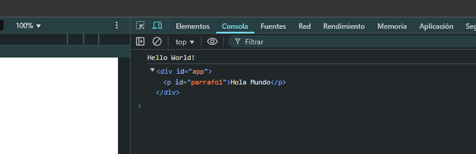
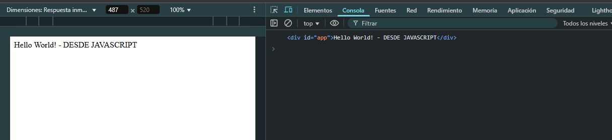

# 6 - DOM y Eventos.
----

## Introducción al DOM

El DOM (Document Object Model) es una representación en forma de árbol de tu página web. Básicamente, cada elemento HTML se convierte en un objeto que JavaScript puede manipular.

:::tip
Cuando el navegador carga esta página, crea un objeto document que representa toda la estructura HTML.
:::

### **Métodos de Acceso al DOM**

### *getElementById()*

El método getElementById() se utiliza para acceder a un único elemento del DOM que tiene un atributo id específico

```jsx title="Sintaxsis"
let elemento = document.getElementById('id-del-elemento');
```

```jsx title="Ejemplo"
// HTML de referencia
<div id="app">
  <p id="parrafo1">Hola Mundo</p>
</div>

// JavaScript
let div = document.getElementById("app");
let parrafo = document.getElementById("parrafo1");

console.log(div.innerHTML); // Muestra el contenido HTML dentro del div
console.log(parrafo.innerHTML); // Muestra "Hola Mundo"
```



<br/>

### *getElementsByClassName()*

El método getElementsByClassName() se usa para obtener todos los elementos que tienen una clase específica. Este método retorna una colección de nodos (HTMLCollection) que contiene todos los elementos que coinciden con la clase proporcionada.

```jsx title="Sintaxsis"
let elementos = document.getElementsByClassName('nombre-de-clase');
```

```jsx title="Ejemplo"
// HTML de referencia
<ul>
  <li class="paises">AR</li>
  <li class="paises">CL</li>
  <li class="paises">UY</li>
</ul>

// JavaScript
let paises = document.getElementsByClassName("paises");
console.log(paises[0].innerHTML); // Muestra "AR"
console.log(paises[1].innerHTML); // Muestra "CL"
console.log(paises[2].innerHTML); // Muestra "UY"
```

<br/>

### *getElementsByTagName()*

El método getElementsByTagName() permite acceder a todos los elementos del DOM que tienen un nombre de etiqueta específico. Al igual que getElementsByClassName(), este método retorna una colección de nodos que coinciden con la etiqueta especificada.


```jsx title="Sintaxis"
let elementos = document.getElementsByTagName('nombre-de-etiqueta');
```

```jsx title="Ejemplo"
// HTML de referencia
<div>
  <div>CONTENEDOR 2</div>
  <div>CONTENEDOR 3</div>
</div>

// JavaScript
let contenedores = document.getElementsByTagName("div");
console.log(contenedores[0].innerHTML); // Muestra "CONTENEDOR 2"
console.log(contenedores[1].innerHTML); // Muestra "CONTENEDOR 3"
```

<br/>

### Acceso Moderno al DOM

### *querySelector()*

El método querySelector() es una herramienta poderosa en JavaScript que permite seleccionar el primer elemento del DOM que coincida con uno o más selectores CSS especificados. Este método es especialmente útil cuando se necesita acceder rápidamente a un solo elemento que cumpla con ciertos criterios, utilizando la misma sintaxis que se usa en CSS.

```jsx title="Sintaxis"
let elemento = document.querySelector('selector-css');

//selector-css: Puede ser cualquier selector válido en CSS, como un id, una clase, un atributo, o una combinación de estos.

```

```jsx title="Ejemplo"

// selecciona el primer elemento <h1> en el DOM.
let encabezado = document.querySelector('h1');

// selecciona el primer elemento con la clase texto-destacado.
let parrafo = document.querySelector('.texto-destacado');

// selecciona el primer enlace con el atributo href que apunta a #seccion.
let elementoEnlace = document.querySelector('a[href="#seccion"]');
```
<br/>

### *querySelectorAll()*

El método querySelectorAll() es similar a querySelector(), pero en lugar de devolver solo el primer elemento coincidente, devuelve una lista estática de todos los elementos que coinciden con los selectores CSS especificados. La lista devuelta es de tipo NodeList, que puede ser iterada con métodos como forEach.

```jsx title="Ejemplo"
let elementos = document.querySelectorAll('selector-css');
```

```jsx title="Ejemplo"

// selecciona todos los elementos <p> en el DOM y los devuelve en una NodeList.
let parrafos = document.querySelectorAll('p');

// selecciona todos los elementos <li> que son hijos directos de un elemento <ul> con la clase menu.
let itemsMenu = document.querySelectorAll('ul.menu li');
```

### **Modificar nodos existentes**

### *innerHTML*

Este método permite leer o modificar el contenido HTML interno de un elemento. Se utiliza para actualizar todo el contenido de un nodo de una sola vez.

```jsx title="Ejemplo"
let contenedor = document.getElementById('contenedor');

contenedor.innerHTML = '<h2>Nuevo título</h2><p>Nuevo párrafo</p>';
```

<br/>

### *innerText / textContent* 

Permiten modificar el texto dentro de un nodo. innerText considera el estilo y el renderizado actual, mientras que textContent devuelve el contenido textual sin tener en cuenta el estilo.

```jsx title="Ejemplo"
let titulo = document.getElementById('titulo');
titulo.innerText = 'Texto actualizado';
```




<br/>

### *setAttribute()* 

Se usa para modificar o establecer un nuevo atributo en un elemento.

```jsx title="Ejemplo"
let enlace = document.querySelector('a');
enlace.setAttribute('href', 'https://www.example.com');
```

<br/>

### **Añadir nodos**

### *createElement()* 

Este método permite crear un nuevo elemento en el DOM.

```jsx title="Ejemplo"
let nuevoDiv = document.createElement('div');

nuevoDiv.innerHTML = '<p>Este es un nuevo div</p>';

document.body.appendChild(nuevoDiv);
```
<br/>

### *appendChild()* 

Añade un nodo como el último hijo de un nodo padre.

```jsx title="Ejemplo"
let lista = document.getElementById('lista');
let nuevoItem = document.createElement('li');
nuevoItem.textContent = 'Nuevo ítem';
lista.appendChild(nuevoItem);
```

<br/>

### *insertBefore()* 

Inserta un nodo antes de un nodo hijo específico.

```jsx title="Ejemplo"
let primerItem = lista.firstChild;
lista.insertBefore(nuevoItem, primerItem);
```

### **Eliminar nodos**

### *removeChild()* 

Este método elimina un nodo hijo de un elemento.

```jsx title="Ejemplo"
let itemAEliminar = document.getElementById('item');
lista.removeChild(itemAEliminar);
```

<br/>

### *remove()*

Elimina directamente el nodo seleccionado.

```jsx title="Ejemplo"
let elemento = document.getElementById('elemento');
elemento.remove();
```
<br/>

---------------------------------------

## Plantillas Literales

Las plantillas literales, introducidas en ES6, son una característica poderosa en JavaScript que permite la creación de cadenas de texto más dinámicas y flexibles. 
Se definen utilizando comillas invertidas (`) en lugar de las comillas simples o dobles tradicionales. Esto permite incluir variables y expresiones. Además, las plantillas literales permiten la creación de cadenas de múltiples líneas sin necesidad de concatenación o caracteres especiales.

```jsx title="Sintaxis"
${variable}
```


```jsx title="Ejemplo"
const nombre = "Juan";s
const edad = 30;

const contenedor = document.getElementById('info');

contenedor.innerHTML = `
  <h2>Información del Usuario</h2>
  <p>Nombre: ${nombre}</p>
  <p>Edad: ${edad}</p>
`;
```

<br/>

## Eventos

Los eventos en JavaScript permiten detectar e interactuar con acciones del usuario, como clics, movimientos del mouse, teclas presionadas, carga de la página, entre otros. Son fundamentales para hacer páginas web dinámicas e interactivas.

###  Escuchar eventos con addEventListener

La forma más flexible de manejar eventos es usando addEventListener(). Se pasa una función anónima como argumento a addEventListener.

```jsx title="Ejemplo sin captura de evento"
const boton = document.getElementById("miBoton");

boton.addEventListener("click", function() {
  alert("¡Hiciste clic en el botón!");
});
``` 

<br/>

```jsx title="Ejemplo con captura de evento"
document.addEventListener("keydown", function(event) {
  console.log(`Tecla presionada: ${event.key}`);
});
``` 

### Diferentes tipos de eventos

Algunos eventos comunes son:

**click**     → Cuando el usuario hace clic.

**mouseover** → Cuando el mouse pasa sobre un elemento.

**mouseout**  → Cuando el mouse sale del elemento.

**keydown**   → Cuando se presiona una tecla.

**keyup**     → Cuando se suelta una tecla.

**change**    → Cuando cambia el valor de un input.

**submit**    → Cuando se envía un formulario.

<br/>

---------------------------------

## Enlaces y rutas

Enlaces en HTML
En HTML, los enlaces son fundamentales para la navegación web, permitiendo a los usuarios moverse entre páginas y secciones. A continuación, se describe cómo crear y utilizar enlaces relativos, absolutos e internos, junto con ejemplos prácticos y su relación con la estructura del sitio web.

### Enlaces Relativos

Los enlaces relativos apuntan a recursos ubicados en la misma estructura o servidor que la página actual. Son útiles cuando se enlaza a otros documentos o recursos dentro del mismo sitio web. Su principal ventaja es la flexibilidad al mover el sitio a diferentes dominios o servidores, ya que los enlaces siguen funcionando sin necesidad de modificaciones.

```jsx title="Ejemplo"
<a href="pagina2.html">Ir a la página 2</a>
```

#### Subdirectorios

Este enlace apunta a pagina3.html dentro de la carpeta carpeta.

```jsx title="Ejemplo"
<a href="./pagina3.html">Ir a la página 3</a>
```


#### Directorios Padres

Este enlace navega un nivel hacia arriba en la estructura de directorios antes de buscar pagina4.html.

```jsx title="Ejemplo"
<a href="../pagina4.html">Ir a la página 4</a>
```

### Enlaces Absolutos

Los enlaces absolutos especifican la ruta completa a un recurso, incluyendo el protocolo (como http:// o https://), el dominio, y la ruta completa del archivo. Estos enlaces son esenciales para apuntar a recursos externos o cuando se quiere garantizar que el enlace funcione independientemente de la ubicación del documento actual.

```jsx title="Ejemplo"
<a href="https://www.ejemplo.com/pagina2.html">Visitar Ejemplo</a>
```

### Enlaces Internos

Los enlaces internos (o anclas) permiten navegar dentro de la misma página o a secciones específicas de otra página. Se utilizan comúnmente para facilitar la navegación en documentos largos.

```jsx title="Ejemplo"
<a href="#seccion1">Ir a la Sección 1</a>
...
<h2 id="seccion1">Sección 1</h2>
```

#### Enlaces internos a otras páginas:

```jsx title="Ejemplo"
<a href="pagina2.html#seccion2">Ir a la Sección 2 en Página 2</a>
```
