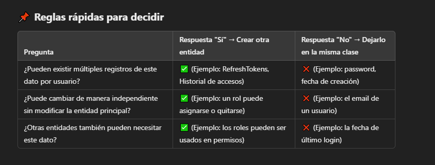

# 1 - Nuevos Desarrollos


## Flujo de Autenticación

1. #### Inicio del Proceso de Autenticación

    - El proceso comienza cuando el usuario intenta iniciar sesión enviando sus credenciales (nombre de usuario y contraseña) al endpoint ("/login"). La solicitud es procesada por el método **login()** en el controlador, el cual delega la autenticación al servicio **userDetailsService.loginUser()**.

    ```jsx title=""
    @PostMapping("/login")
    public ResponseEntity<Response<AuthResponseDTO>> login(@RequestBody @Valid AuthLoginRequestDTO userRequest) {
        Response<AuthResponseDTO> response = this.userDetailsService.loginUser(userRequest);
        return new ResponseEntity<>(response, HttpStatus.OK);
    }
    ```

  

    - *(La clase userDetailsService tiene métodos que gestionan la autenticación de los usuarios, valida las credenciales, y devuelve un token JWT cuando la autenticación es exitosa.)*

2. #### Autenticación de las credenciales

    -   El método **LoginUser** autentica las credenciales por medio del método **authenticate** de la misma clase.

3. #### authenticate.

    -   3.1 El método **authenticate** realiza tres pasos principales:

        - **Obtiene los detalles del usuario** : Por medio del método **loadUserByUsername**  recupera los detalles del usuario desde la base de datos(Ej Roles y permisos) y los carga en una lista GrantedAuthority que luego se asignará a la autenticación. Este es un método crucial porque Spring Security necesita los detalles del usuario en un formato específico (UserDetails) para realizar la autenticación.

            -----------------------------------------------------------------------------
            #### loadUserByUsername

            -   El método retorna un UserDetails, que es una interfaz de Spring Security que encapsula la información necesaria para la autenticación y autorización de un usuario.

            -   Spring Security utiliza un objeto **User** con los detalles de usuario que contiene la lista de roles y permisos en formato **GrandAuthorityList**

            -   Si no se devuelve un UserDetails, Spring Security no podría gestionar correctamente el proceso de autenticación ni autorizar al usuario para acceder a recursos protegidos.

            --------------------------------------------------------------------------------

        -  **Compara Contraseñas**:  Verifica la contraseña recibida utilizando **PasswordEncoder**, en caso de no coinicidir, incrementa los intentos fallidos y bloquea la misma si alcanza el limite.

        - Verifica si la cuenta está activa

        - Luego de pasar todos los filtros, reinicia a cero los intentos fallidos de inicio de sesión

        - **Genera Authentication**: Si las credenciales son correctas, el método crea un objeto **UsernamePasswordAuthenticationToken** con el nombre de usuario, la contraseña y las autoridades del usuario con el userDetails recibido del **loadUserByUsername** . Este objeto es esencial porque es lo que Spring Security usa para mantener la autenticación del usuario en el contexto de seguridad.


<br/>


4. **Generación del JWT y respuesta al cliente:**

Cuando la autenticación es exitosa, se devuelve el control al método **loginUser** que realiza:

    - Almacenamiento de la autenticación en **SecurityContextHolder**
    *(El objeto Authentication contiene información sobre el usuario autenticado, como el nombre de usuario, contraseñas y roles o permisos. De aqui tomará información los filtros de seguridad)*

    - Llama al método **createToken** en la clase JwtUtils, lo que genera un JWT que contiene:

        -   El nombre de usuario (obtenido de authentication.getPrincipal()).
        -   Las autoridades o permisos (obtenidos de authentication.getAuthorities() y convertidos a un formato de cadena separada por comas).
        -   El issuer (quién generó el token).
        -   La fecha de expiración (en este caso, 30 minutos después de la emisión).
        -   Un ID único para el token.
        -   La fecha de inicio de validez (el token es válido inmediatamente).
        -   El token se firma utilizando el HMAC256 y una clave secreta, garantizando su integridad y seguridad.

*(La clase JwtUtils se encarga de manejar la creación, validación y extracción de información de un token JWT)*

    - **Elimina el Refresh Token anterior y genera uno nuevo**: Además del JWT, también se genera un refresh token, que se guarda en la base de datos. Este token permite renovar el JWT sin requerir que el usuario ingrese sus credenciales nuevamente.

    -  Por último, el método **loginUser** devuelve un objeto AuthResponseDTO, que incluye:
        - El nombre de usuario y los roles del usuario.

        - El JWT generado

        - El refresh Token  
    
     El token y el refresh Token deberá ser almacenado por el cliente (por ejemplo, en el almacenamiento local o en cookies seguras) y enviado en las solicitudes futuras mediante el encabezado HTTP Authorization.


5. **Validación del token en solicitudes posteriores:**

Cuando el cliente envía una solicitud posterior con el token JWT, la cadena de filtros del jwt intercepta la solicitud y  el **JwtTokenValidator** realiza los siguientes pasos:

    -   Extrae el token JWT del encabezado Authorization de la solicitud HTTP.
    -   Verifica la validez del token: Se valida que el token no haya expirado y que su firma sea válida utilizando la clave secreta y el algoritmo HMAC256.

**JWT es válido:** 
    -   Extrae la información del token: Una vez validado, se extraen los datos contenidos en el token, como el nombre de usuario y las autoridades. Estos datos se utilizan para autenticar al usuario y otorgar acceso a los recursos solicitados.
    -   Si el token es válido, la autenticación se completa con éxito y Spring Security configura el contexto de seguridad para la solicitud posterior.

**JWT está expirado:** 

    -   Si el JWT expira, el método refreshToken() permite renovar el JWT utilizando el refresh token.
    -   Se valida el refresh token, se elimina el antiguo y se genera uno nuevo.
    -   Se genera un nuevo JWT y se devuelve al usuario junto con el nuevo refresh token.


-------------------------------------------------------

## Flujo del proceso -  Autenticación con Google OAuth2

1. **Inicio de sesión con Google.**

    -   El usuario selecciona autenticarse con Google.

2. **Autenticación con Google OAuth2:**

    - Spring Security maneja el proceso de autenticación con Google, redirigiendo al usuario para que ingrese sus credenciales de Google.

3. **Configuración de Spring Security:**

    -   En SecurityConfig, se configura el inicio de sesión con OAuth2 y se agrega el filtro OAuth2UserFilter.

4. **Verificación del usuario registrado:**

    -   El filtro **OAuth2UserFilter** verifica si el usuario autenticado por Google está registrado en la base de datos.

5. **Generación del JWT:**

    -   Si el usuario está registrado, se llama a createToken en JwtUtils para generar un JWT.

6. **Generación del Refresh Token:**

    -   Se genera el refresh token.

7. **Respuesta al cliente**

    -   El JWT se añade al encabezado de la respuesta con Authorization: Bearer [token]

8. **Validación del token en solicitudes posteriores:**

Cuando el cliente envía una solicitud posterior con el token JWT, el **JwtTokenValidator** realiza los siguientes pasos:

    -   Extrae el token JWT del encabezado Authorization de la solicitud HTTP.
    -   Verifica la validez del token: Se valida que el token no haya expirado y que su firma sea válida utilizando la clave secreta y el algoritmo HMAC256.
    -   Extrae la información del token: Una vez validado, se extraen los datos contenidos en el token, como el nombre de usuario y las autoridades. Estos datos se utilizan para autenticar al usuario y otorgar acceso a los recursos solicitados.
    -   Si el token es válido, la autenticación se completa con éxito y Spring Security configura el contexto de seguridad para la solicitud posterior.


### Funcionamiento Interno de la Autenticación

#### 📌 ¿Cómo Spring Security procesa la autenticación?

#### Filtros HTTP interceptan las solicitudes:

Antes de llegar al controlador, las solicitudes HTTP pasan por una cadena de filtros de seguridad ubicado en **appConfig**. Este flujo incluye un filtro de autenticación JWT(implementado manualmente) que intercepta la solicitud para realizar tareas como:

-   Extraer el token JWT de la cabecera de la solicitud.

-   Validar la firma del token.

-   Comprobar la validez del token (es decir, si no ha expirado).

Este proceso ocurre al principio del ciclo de vida de la solicitud HTTP, antes de que Spring Security procese la autenticación. Si todo es correcto, Spring Security delega automáticamente la responsabilidad del proceso de autenticación al AuthenticationManager.


#### AuthenticationManager recibe las credenciales y delega la validación:

El AuthenticationManager es el componente que recibe las credenciales de autenticación (nombre de usuario y contraseña) y delega la validación a un AuthenticationProvider específico.

En nuestra implementación, no se usa el AuthenticationManager directamente como Spring Security lo haría por defecto, sino que se creó una lógica personalizada en el método authenticate. Sin embargo, el AuthenticationManager sigue siendo responsable de coordinar este proceso.

#### AuthenticationProvider se encarga de autenticar al usuario:

El AuthenticationProvider se encarga de autenticar al usuario validando las credenciales con los datos almacenados en la base de datos. En tu caso, este paso ocurre implícitamente dentro de la implementación personalizada de autenticación.

-   **Método loadUserByUsername(username):** Este es el punto donde Spring Security (o nuestra implementación personalizada) recupera la información del usuario. Si el usuario no existe, lanzará una excepción (como UserNameNotFoundException). Si el usuario existe, el siguiente paso es validar las credenciales.

-   **Llamada al método authenticate:** acá es donde la lógica desarrollada en el proyecto se encarga de realizar la validación de las credenciales. Spring Security, a través de su AuthenticationProvider, haría este paso automáticamente en su flujo, pero lo estás manejando tú explícitamente.

#### PasswordEncoder verifica que la contraseña sea correcta:

En este punto, el PasswordEncoder compara la contraseña proporcionada por el usuario con la almacenada en la base de datos.

En nuestra implementación, este paso es gestionado de manera explícita en el método authenticate. Si las contraseñas no coinciden, el flujo incrementa los intentos fallidos y puede bloquear la cuenta si se alcanzan los límites establecidos.

En caso de éxito se retorna un objeto Authentication **UsernamePasswordAuthenticationToken** al método **loginUser**

Este paso, que estás manejando de manera explícita, normalmente sería gestionado automáticamente por el AuthenticationProvider en un flujo estándar de Spring Security.

####  El flujo regresa a tu método loginUser después de la autenticación exitosa:

Si la autenticación es exitosa, en el método **loginUser** se realiza las siguientes acciones: 

- El objeto Authentication (que contiene detalles como el nombre de usuario y las autoridades) se almacena en el SecurityContextHolder. Esto permite que el usuario esté autenticado y acceda a los recursos protegidos del sistema durante su sesión, sin necesidad de volver a ingresar sus credenciales en cada solicitud.

- Se elimina el refresh Token anterior.

- Se generar el JWT y el nuevo Refresh Token.

- Se devuelve al cliente un objeto authResponseDTO, con detalles del usuario autenticado.

## --------------------------------------

## CORS  (Cross-Origin Resource Sharing)

Es un mecanismo de seguridad implementado por los navegadores para restringir solicitudes HTTP entre diferentes orígenes (diferente dominio, puerto o protocolo).

Por defecto, los navegadores bloquean las solicitudes hechas desde un origen distinto al del servidor que responde. Esto impide que, por ejemplo, una aplicación web alojada en http://frontend.com haga peticiones a http://api.backend.com sin la autorización explícita del backend.

### ¿Cómo funciona CORS?

Cuando el frontend intenta hacer una petición a otro dominio (cross-origin request), el navegador envía una solicitud preflight (OPTIONS) al servidor para preguntar si permite la comunicación.

El backend debe responder con los encabezados adecuados para permitir la solicitud, como:

**Access-Control-Allow-Origin: http://frontend.com** → Permite solicitudes desde ese origen.

**Access-Control-Allow-Methods: GET, POST, PUT, DELETE** → Define qué métodos están permitidos.

**Access-Control-Allow-Headers: Content-Type, Authorization** → Indica qué encabezados personalizados pueden enviarse.

Si el backend no responde con estos encabezados, el navegador bloquea la solicitud y lanza un error de CORS en la consola.

### ¿Cómo solucionar errores de CORS?

Configurando CORS en el backend:

En Spring Boot, puedes usar @CrossOrigin en los controladores o configurar un filtro global.
En Express (Node.js), puedes usar el paquete cors.
Proxy en desarrollo: Configurar un proxy en el frontend para evitar el problema (Ej: en Angular con proxy.conf.json).

CORS en APIs públicas: Algunas APIs permiten CORS agregando * en Access-Control-Allow-Origin, pero esto es inseguro.

------------------------------------------------------------

## Certificado SSL (Secure Sockets Layer)

Un certificado SSL (Secure Sockets Layer) sirve para cifrar la comunicación entre el navegador del usuario y el servidor web, asegurando que los datos enviados y recibidos no puedan ser interceptados ni modificados por terceros.

#### ¿Por qué es importante el SSL?

**Cifrado 🔒:** Protege información sensible como contraseñas, datos personales y tarjetas de crédito.

**Autenticación ✅:** Garantiza que el usuario se está conectando al servidor correcto y no a un sitio fraudulento.

**Confianza 🏆:** Los navegadores muestran un candado en la barra de direcciones cuando un sitio usa SSL, lo que da confianza a los visitantes.

**SEO 📈:** Google favorece en los resultados de búsqueda a los sitios con SSL habilitado (HTTPS).

Hoy en día, el protocolo SSL ha sido reemplazado por TLS (Transport Layer Security), que es una versión más segura, pero aún se le sigue llamando SSL de manera común.

<br/>


## --------------------------------------


## Java Mail Sender

Es una interfaz de Spring que actúa como un cliente de correo. Permite enviar emails desde una aplicación Java utilizando el protocolo SMTP( Simple Mail Transfer Protocol - Protocolo simple de transferencia de correo) por ejemplo, usando Gmail, Outlook, etc.

Se puede: 

-   Adjuntar archivos con MimeMessageHelper.

-   Enviar correos HTML.

-   Enviar a varios destinatarios.

-   Agregar imágenes incrustadas.

<br/>

1.  Configuración del servidor SMTP

En el archivo application.properties o application.yml, configuras los datos del servidor de correo.

```jsx title=""
spring.mail.host=smtp.gmail.com
spring.mail.port=587
spring.mail.username=tu.email@gmail.com
spring.mail.password=tu_contraseña
spring.mail.properties.mail.smtp.auth=true
spring.mail.properties.mail.smtp.starttls.enable=true
``` 


2. Crear un servicio e inyecatar JavaMailSender

```jsx title=""
@Autowired
private JavaMailSender mailSender;

``` 

3. Crear el mensaje
```jsx title=""
SimpleMailMessage message = new SimpleMailMessage();
message.setFrom("tu.email@gmail.com");
message.setTo("destinatario@email.com");
message.setSubject("Asunto del correo");
message.setText("Contenido del correo");

``` 

### Configurar usuario y contraseña

✅ Opción recomendada: Usar una contraseña de aplicación

-   Ve a https://myaccount.google.com/

-   Inicia sesión con la cuenta de Gmail que vas a usar.

-   Asegúrate de tener habilitada la verificación en dos pasos (es obligatorio).

-   Luego ve a Seguridad > Contraseñas de aplicaciones.

-   Crea una nueva contraseña de aplicación (elige "Correo" y "Otro (nombre personalizado)", como por ejemplo "Spring App").

-   Google te generará una contraseña de 16 caracteres. Esa será tu ${EMAIL_PASSWORD}.


## --------------------------------------


## @Audited

@Audited es una anotación que ofrece Hibernate Envers para registrar automáticamente los cambios históricos de una entidad en la base de datos. Cada vez que se crea, actualiza o elimina una entidad, se guarda una copia del estado anterior en una tabla de auditoría.

Así, podés consultar el "historial" de una entidad, como si fuera un sistema de versiones.

### Requisitos previos

-   Tener una app Spring Boot con JPA y una base de datos configurada (H2, PostgreSQL, MySQL, etc.)

-   Usar Hibernate como proveedor JPA (es el default en Spring Boot)

### Paso 1: Agregar la dependencia de Hibernate Envers
```jsx title="POM.xml"
	<dependency>
			<groupId>org.hibernate.orm</groupId>
			<artifactId>hibernate-core</artifactId>
			<version>6.4.4.Final</version>
		</dependency>


		<!--Dependencia para generar tablas de auditoría ante cambios de persistencia -->
		<dependency>
			<groupId>org.hibernate.orm</groupId>
			<artifactId>hibernate-envers</artifactId>
			<version>6.4.4.Final</version>
		</dependency>

``` 

### Paso 2: Anotar las entidades con @Audited

En la entidad a auditar debemos:

-   Colocar @Audited como anotación de la entidad

En caso que querramos excluir algún atributo podremos hacerlo de la siguiente manera:

-    @NotAudited : Para campo simples

-   @Audited(targetAuditMode = RelationTargetAuditMode.NOT_AUDITED) : Para campos donde existan relaciones (Ej: @ManyToOne)

En el caso que un campo con una relación deba ser auditado, la **entidad relacionada** también deberá llevar la anotación  @Audited

```jsx title=""
@Entity
@Inheritance(strategy = InheritanceType.JOINED)
@Data
@Audited <----
public abstract class Person {

    @Id
    @GeneratedValue(strategy = GenerationType.IDENTITY)
    private Long id;

    @Column(length = 30, nullable = false)
    private String firstName;

    @Column(length = 30, nullable = false)
    @NotAudited  <-----
    private String lastName;

    @ManyToOne(fetch = FetchType.LAZY, targetEntity = DniType.class)
    @Audited(targetAuditMode = RelationTargetAuditMode.NOT_AUDITED) <-----
    @JoinColumn(name = "dni_type_id")
    private DniType dniType;

}
``` 


## --------------------------------------

## Estructura de datos

### Normalización de tablas
<br/>

#### Set de Datos


<br/>

#### 1° Forma Normal

→ Separamos los datos para que cada celda tenga un solo valor

→ Cada combinación única se pone en una fila


<br/>

#### 2° Forma Normal

-   Solo se aplica si la PK es compuesta.

-   Si la clave primaria tiene dos columnas (compuesta), cada dato de la tabla debe depender de las dos juntas, no de una sola.


👉 Aquí la clave primaria es (ID_Alumno + Curso), porque un mismo alumno puede estar en varios cursos.

🔍 Ahora revisamos qué columna depende solo de parte de la clave:

Nombre_Alumno depende solo de ID_Alumno

❌ No depende del curso → ¡esto rompe la regla de 2FN!

Profesor depende del curso

❌ No depende del alumno → también rompe la regla


<br/>

#### 3° Forma Normal

-   Eliminar columnas que no dependen directamente de la clave primaria, sino de otra columna.

-   En este caso, en la tabla Curso_Profesor, el profesor depende del curso, no necesitamos modificar más porque ya cumple 3FN.


<br/>

### Relaciones

#### OneToOne

-   En una relación OneToOne la clave foránea (FK) siempre va en la entidad dependiente de la relación o de la "menos importante"

Ejemplo, si tenemos 2 entidades:
    -   User (importante)
    -   Refresh Token (dependiente)

El usuario puede existir sin un refresh (usuario NO autenticado), en cambio para que el refresh se genere debe primero existir un usuario.

```jsx title="Entidad Refresh"
@OneToOne
    @JoinColumn(name = "user_id", nullable = false, unique = true)  // FK en RefreshToken
    private UserSec user;
``` 

<br/>

#### OneToMany o ManyToOne

-   En una relación OneToMany o ManyToOne la FK SIEMPRE estará del lado de "Muchos", ejemplo:

Un empleado trabaja en un departamento (Empleado ↔ Departamento)

Un departamento tiene muchos empleados.

Un empleado solo puede pertenecer a un departamento.


🔹 ¿Quién depende de quién? → Empleado depende de Departamento.

🔹 ¿Dónde está el "muchos"? → Empleado.


<br/>

#### ManyToMany

La relación solo está del lado de la tabla intermedia.

- Se crea una tabla intermedia con las PK de las otras dos tablas.

- Las 2 tablas en cuestión, se desconocen entre sí.

- Las 2 tablas en cuestión, desconocen la tabla intermedia.


<br/>

#### -  Cuando saber si un dato debe ser una tabla o un campo de otra tabla



<br/>

## --------------------------------------


## Model

-   Colocar @Entity en la clase

-   Colocar @Data en la clase

    -   Lombok crea automáticamente:

        ✅ getters y setters para todos los campos

        ✅ toString()

        ✅ equals() y hashCode()

        ✅ Un constructor vacío

        ✅ Métodos canEqual() (útil para herencia)

-   Nombrar la tabla en inglés @Table(name= "nombre")

-   Agregar restricciones de bases de datos en los atributos con la anotación @Column o @JoinColumn para relaciones.


```jsx title="Ejemplo"
@Entity
@Data
@Table(name= "countries")
public class Pais {

    @Id
    @GeneratedValue(strategy = GenerationType.IDENTITY)
    private long id;

    @Column(length = 15, unique = true, nullable = false)
    private String name;

    @Column(length = 15, unique = true, nullable = false)
    private String nationality;

    @Column(nullable = false)
    private boolean enabled;
}
``` 


<br/>

### Pensar las relaciones

Una pregunta clave que siempre podés hacerte para no marearte:

-   ¿Un solo registro (fila) de esta entidad a cuántos registros de la otra entidad se puede asociar?

-   ¿Y al revés?

Ahora, apliquémoslo bien despacio a tu ejemplo de historia clínica y paciente:

¿Una historia clínica a cuántos pacientes se asocia?

    -   A uno solo. Esa historia clínica es de un paciente específico. ✔️

¿Un paciente puede tener varias historias clínicas (varios registros de MedicalHistory)?

    -   Sí, un paciente puede tener muchas historias clínicas (porque puede tener consultas en distintas fechas). ✔️


Entonces la relación correcta es:

Muchos MedicalHistory ➡️ Un Patient

(o dicho más "de base de datos": ManyToOne, como vos pusiste)

<br/>

### Sintaxis Relación OneToOne

La relación estará del lado de la entidad menos importante o dependiente.

Agregaremos:

-   Un atributo de la otra clase usando composición.

-   Anotation @OneToOne

-   Propiedad (fetch = FetchType.LAZY, targetEntity = UserSec.Class) para establecer:

    - Carga perezosa

    - Clase se hará la relación.

-   Ver si corresponde agregar propiedad "cascade = CascadeType.xxx" para establecer comportamiento en cascada. Es decir, cualquier acción de insertar, eliminar, actualizar, etc impactará en la tabla relacionada.

- Utilizamos la annotation @JoinColumn para establecer el nombre en la columna unión.

```jsx title="Entidad Refresh"
@OneToOne(fetch = FetchType.LAZY)
    @JoinColumn(name = "user_id", nullable = false, unique = true)  // FK en RefreshToken
    private UserSec user;
``` 


### Sintaxis Relación ManyToOne o OneToMany

En la entidad Muchos:

- Un atributo de la otra clase usando **composición.**

- Anotation @ManyToOne(fetch = FetchType.LAZY, targetEntity = otraClase.class): Especifica la entidad destino de la relación.

- Utilizamos la annotation @JoinColumn: Establece el nombre en la columna unión.

```jsx title="Entidad MUCHOS"
@ManyToOne(fetch = FetchType.LAZY, targetEntity = NombreClaseEntidadUno.class) // Curso.class
@JoinColumn(name = "curso_id")
private Curso curso;

``` 

#### Para Agregar Bidireccionalidad (no recomendando)

En la entidad Uno:

-   Colocaremos una lista del otro objeto usando  **composición.**

- Anotation @OneToMany(targetEntity = otraEntidad.class, fetch = FetchType.LAZY, mappedBy = atributoDeLaOtraEntidad)


### Sintaxis Relación ManyToMany

- Un atributo de la otra clase usando **composición.**

- Anotation @ManyToMany(targetEntity = otraClase.class)

- Anotation @JoinTable


```jsx title="Entidad CLUB"
@JoinTable(
    name = "club_competitions",   // 1 Nombre tabla intermedia
    joinColumn = @JoinColumn(name = "club"), // 2 Nombre de la columna
    inverseJoinColumns = @JoinColumn(name= "competition") // 3 Nombre de la columna
)
private List<OtraEntidad> otraEntidad;

``` 
1. Nombre tabla intermedia

2. Define el nombre de la columna de clave foránea en la tabla intermedia (club_competitions) que apunta a la entidad actual (Club). En este caso, la columna club en la tabla intermedia referenciará el ID de la tabla Club.

3. Define el nombre de la columna de clave foránea inversa en la tabla intermedia que apunta a la entidad relacionada (Competition).


<br/>

### Herencia

🔧 En JPA (Spring Boot):

#### @MappedSuperclass

-   No se crea una tabla para la clase Padre en la base de datos.

-   Las clases hijas heredan sus atributos y esos campos van directo en la tabla hija.

-   No se pueden hacer relaciones hacia clase Padre, ni consultas con @Query("from clasePadre").

```jsx title="Clase Persona - Padre"

@MappedSuperclasgit 
@Data
// NO USAR @Table
public abstrac class Persona {

    @Id
    @GeneratedValue(strategy = GenerationType.IDENTITY)
    private Long id;

    private String nombre;
}

``` 


```jsx title="Clase Empleado - Hija"
@Entity
@Data
public class Empleado extends Persona {

    //Hereda id de persona

    private String legajo;
}

``` 

<br/>

#### @Entity + @Inheritance (Recomendando)

-   Se crea una tabla clase Padre con los campos comunes.

-   Las tablas hijas  tienen los campos propios y una clave foránea hacia Padre.

-   Se pueden hacer consultas y relaciones con Padre.


```jsx title="Clase Persona - Padre"

@Entity
@Inheritance(strategy = InheritanceType.JOINED) // Crea una tabla para cada entidad.
@Table(name = "people")
@Data
public abstrac class Persona {

    @Id
    @GeneratedValue(strategy = GenerationType.IDENTITY)
    private Long id;

    private String nombre;
}

``` 


⚠️ IMPORTANTE:

-   No hay que declarar @Id en la clase hija (Empleado), ya lo hereda de Persona.

-   No necesitás poner manualmente la relación entre las tablas. JPA lo maneja.


## --------------------------------------

## Controller
1. Colocar @RestController
2. Colocar ruta de controller
3. Colocar @PreAuthorize("denyAll()")
4. Que tipo de método? get, post? y ruta
5. Que tipo de autorización requiere.
6. Que tipo de respuesta necesito dar?
7. Que dato necesito recibir y validaciones de entrada debe tener
8. Realizar la documentación.


```jsx title="Ejemplo Encabezado "
/**
 * Controlador encargado de gestionar los usuarios en el sistema. Proporciona operaciones para obtener
 * el listado de usuarios, obtener un usuario específico por su ID y crear nuevos usuarios.
 * <p>
 * Este controlador requiere el rol <b>ADMIN</b> para acceder a sus métodos.
 * </p>
 * <p>
 * Los métodos disponibles son:
 * <ul>
 *   <li><b>GET /api/user/all</b>: Obtiene el listado completo de usuarios.</li>
 *   <li><b>GET /api/user/{id}</b>: Obtiene un usuario específico por su ID.</li>
 *   <li><b>POST /api/user/</b>: Crea un nuevo usuario en el sistema.</li>
 *   <li><b>PATCH /api/user/</b>: Actualiza un usuario en el sistema.</li>
 * </ul>
 * </p>
 * <p>
 * <b>Roles necesarios:</b> <b>ADMIN</b>
 * </p>
 */
@RestController
@RequestMapping("/api/user")
@PreAuthorize("denyAll()")
public class UserController {

    @Autowired
    private IUserService userService;

``` 

```jsx title="Crear"
/**
     * Crea un nuevo usuario en el sistema.
     * <p>
     * Requiere el rol <b>ADMIN</b> para acceder.
     * </p>
     *
     * @param userSecCreateDto Datos del usuario a crear.
     * @return ResponseEntity con:
     *         <ul>
     *         <li><b>201 Created</b>: Usuario creado exitosamente.</li>
     *         <li><b>401 Unauthorized</b>: No autenticado.</li>
     *         <li><b>403 Forbidden</b>: No autorizado para acceder a este recurso.</li>
     *         <li><b>404 Not Found</b>: Roles y/o permisos requeridos no encontrados.</li>
     *         <li><b>409 Conflict</b>: Usuario existente en el sistema.</li>
     *         </ul>
     */

    @Operation(summary = "Crear usuario", description = "Crea un nuevo usuario en el sistema.")
    @ApiResponses({
            @ApiResponse(responseCode = "200", description = "Usuario Creado exitosamente."),
            @ApiResponse(responseCode = "401", description = "No autenticado."),
            @ApiResponse(responseCode = "403", description = "No autorizado para acceder a este recurso."),
            @ApiResponse(responseCode = "404", description = "Roles y/o permisos requeridos no encontrados."),
            @ApiResponse(responseCode = "409", description = "Usuario existente en el sistema.")
    })
    @PostMapping
    @PreAuthorize("hasAnyRole(T(com.odontologiaintegralfm.enums.UserRole).Desarrollador.name()," +
                             "T(com.odontologiaintegralfm.enums.UserRole).Administrador.name())")
    public  ResponseEntity<Response<UserSecResponseDTO>> createUser(@Valid @RequestBody UserSecCreateDTO userSecCreateDto) {
        Response<UserSecResponseDTO>response = userService.save(userSecCreateDto);
        return new ResponseEntity<>(response, HttpStatus.CREATED);
    }

``` 


```jsx title="Obtener todos"
 /**
     * Lista todos los usuarios.
     * <p>Requiere rol <b>ADMIN</b> para acceder.</p>
     * @return ResponseEntity con:
     * <ul>
     *     <li><b>200 OK</b> Lista de usuarios recuperada exitosamente.</li>
     *     <li><b>401 Unauthorized</b>: No autenticado.</li>
     *     <li><b>403 Forbidden</b>: No autorizado para acceder a este recurso.</li>
     * </ul>
     */
    @Operation(summary = "Obtener listado de usuarios", description = "Lista todos los usuarios.")
    @ApiResponses({
            @ApiResponse(responseCode = "200", description = "Usuarios Encontrados."),
            @ApiResponse(responseCode = "401", description = "No autenticado."),
            @ApiResponse(responseCode = "403", description = "No autorizado para acceder a este recurso."),
    })
    @GetMapping("/all")
    @PreAuthorize("hasAnyRole(T(com.odontologiaintegralfm.enums.UserRole).Desarrollador.name()," +
                             "T(com.odontologiaintegralfm.enums.UserRole).Administrador.name())")
    public ResponseEntity<Response<List<UserSecResponseDTO>>> getAllUsers() {
        Response<List<UserSecResponseDTO>> response = userService.getAll();
        return new ResponseEntity<>(response, HttpStatus.OK);
    }
``` 

   

```jsx title="Obtener por ID"

    /**
     /**
     * Obtiene un usuario por su ID.
     * <p>
     * Requiere el rol <b>ADMIN</b> para acceder.
     * </p>
     *
     * @param id ID del usuario a buscar.
     * @return ResponseEntity con:
     *         <ul>
     *         <li><b>200 OK</b>: Usuario encontrado exitosamente.</li>
     *         <li><b>401 Unauthorized</b>: No autenticado.</li>
     *         <li><b>403 Forbidden</b>: No autorizado para acceder a este recurso.</li>
     *         <li><b>404 Not Found</b>: Usuario no encontrado.</li>
     *         </ul>
     */
    @Operation(summary = "Obtener usuario", description = "Obtiene un usuario por su ID")
    @ApiResponses({
            @ApiResponse(responseCode = "200", description = "Usuario encontrado exitosamente."),
            @ApiResponse(responseCode = "401", description = "No autenticado."),
            @ApiResponse(responseCode = "403", description = "No autorizado para acceder a este recurso."),
            @ApiResponse(responseCode = "404", description = "Usuario no encontrado.")
    })
    @GetMapping("/{id}")
    @PreAuthorize("hasAnyRole(T(com.odontologiaintegralfm.enums.UserRole).Desarrollador.name()," +
                             "T(com.odontologiaintegralfm.enums.UserRole).Administrador.name())")
    public ResponseEntity<Response<UserSecResponseDTO>> getUserById(@PathVariable Long id) {
        Response<UserSecResponseDTO>response = userService.getById(id);
        return new ResponseEntity<>(response, HttpStatus.OK);

    }

``` 


```jsx title="Actualizar "


    /**
     * Actualiza la información de un usuario.
     * Este endpoint permite a los usuarios con rol de "ADMIN" actualizar los datos de un usuario existente.
     * @param userSecUpdateDto Objeto que contiene los datos del usuario a actualizar. Debe ser válido según las
     * restricciones de la clase {@link UserSecUpdateDTO}.
     * @return ResponseEntity con:
     *         <ul>
     *         <li><b>200 OK</b>: Usuario actualizado exitosamente.</li>
     *         <li><b>401 Unauthorized</b>: No autenticado.</li>
     *         <li><b>403 Forbidden</b>: No autorizado para acceder a este recurso.</li>
     *         <li><b>404 Not Found</b>: Roles y/o permisos requeridos no encontrados.</li>
     *         <li><b>409 Conflict</b>: Usuario existente en el sistema o se intenta actualizar a un rol DEV.</li>
     *         </ul>
     */
    @Operation(summary = "Actualizar usuario", description = "Actualizar un usuario en el sistema.")
    @ApiResponses({
            @ApiResponse(responseCode = "200", description = "Usuario Actualizado exitosamente."),
            @ApiResponse(responseCode = "401", description = "No autenticado."),
            @ApiResponse(responseCode = "403", description = "No autorizado para acceder a este recurso."),
            @ApiResponse(responseCode = "404", description = "Roles y/o permisos requeridos no encontrados."),
            @ApiResponse(responseCode = "409", description = "Usuario existente en el sistema o se intenta actualizar a un rol DEV.")
    })
    @PatchMapping
    @PreAuthorize("hasAnyRole(T(com.odontologiaintegralfm.enums.UserRole).Desarrollador.name()," +
                             "T(com.odontologiaintegralfm.enums.UserRole).Administrador.name())")
    public ResponseEntity<Response<UserSecResponseDTO>> updateUser(@Valid @RequestBody UserSecUpdateDTO userSecUpdateDto) {
       Response<UserSecResponseDTO> response =  userService.update(userSecUpdateDto);
       return new ResponseEntity<>(response, HttpStatus.OK);

    }
``` 


## --------------------------------------

## Service
1.  Colocar @Service en la clase
2.  Anotaciones de @Transactional para escritura en bd solo a **metodos públicos**
3.  Utilizar try catch para BD
4.  Pensar bien todas las Validaciones e intentar realizar método reutilizables.
5.  Nombre de métodos:
  
    ✔ Usa getXxx si el objeto siempre debe existir y lanzarás una excepción si no lo encuentras (Servicio)

    ✔ Usa findXxx si el objeto puede no existir y quieres que el llamador decida cómo manejarlo.(Repositorio)

    **Resumen**

    **Repositorios:** Los métodos del repositorio, como findById, están diseñados para realizar consultas y devolver resultados, pero no deben lanzar excepciones. Devuelven un Optional< T> o List< T>, ya que el recurso puede o no existir.
    -   find
    -   findAll
    -   exists
    -   etc.

    **Servicios:** En el servicio, los métodos deberían ser responsables de validar si los resultados del repositorio cumplen con las expectativas de la lógica de negocio. Si un recurso debe existir, entonces el método del servicio puede usar getXxx y lanzar excepciones si no se encuentra el recurso.
    -  get
    -  create
    -  update
    -  delete
    -  etc


## --------------------------------------

## Repository

Crear uno por cada entidad. En algunos casos podría hacerse un solo service (ej: geoService) que se conecte a cada repository (ej, pais, prov, localidad)


1. Poner annotation @Repository

2. Extiende(hereda) JpaRepository < NombreEntidad, TipoDatoId >

```jsx title=""
@Repository
public interface IRefreshTokenConfigRepository extends JpaRepository<RefreshTokenConfig, Long>
``` 

Métodos básicos sin necesidad de agregar nada en Respository: 

-   findAll()

-   findById(ID id)

-   save(T entity)

-   saveAll(Iterable< T > entities)

-   deleteById(ID id)

-   delete(T entity)

-   existsById(ID id)

-   count()


### @EntityGraph

@EntityGraph es una anotación que permite, de manera más limpia y declarativa, indicar qué asociaciones deben ser cargadas junto con la entidad principal.

```jsx title=""
@EntityGraph(attributePaths = {"details"})
List<Consultation> findByPatientId(Long patientId);
``` 


### JoinFetch

Es una cláusula de JPQL que permite definir manualmente la consulta y especificar qué asociaciones deben ser cargadas junto con la entidad principal.

Se utiliza cuando se necesita más control sobre la consulta, por ejemplo, para aplicar filtros adicionales, ordenamientos o combinaciones de joins personalizados.


```jsx title=""
@Query("""
      SELECT c 
      FROM Consultation c 
      JOIN FETCH c.details 
      WHERE c.patient.id = :patientId
      """)
List<Consultation> findWithDetailsByPatientId(@Param("patientId") Long patientId);
``` 

## --------------------------------------

## DTO

### Validaciones

1. @NotNull

-   Parte de la especificación de validación de Java.

-   Verifica que el valor de un atributo no sea null, es decir que exista **pero podría estar vacío.**

**Aplicar a: tipos de datos objeto (Long, Integer, Double, LocalDate, List, Set, etc.).**


2. @NotEmpty

-   Parte de la especificación de validación de Java.

-   Verifica que un campo no esté null ni esté vacío (cadena vacía "", lista vacía [], mapa vacío {}).

-   No chequea si hay solo espacios (eso es @NotBlank).

**Aplicar a: String, List, Set, Map, Array.**


3. @NotBlank

-   Parte de la especificación de validación de Java.

-   Verifica que el valor no sea null, no esté vacío "", y no contenga solo espacios en blanco (" ").

-   Es más estricto que @NotEmpty, porque también revisa los espacios.

**Aplicar a: únicamente en String.**


4. @NonNull

-   Similar a @NotNull, pero es parte de Lombok (no es parte de la especificación de validación de Java). @NonNull también asegura que el valor no sea null, pero genera una validación a nivel de código, no directamente en el framework de validación.

-   Verifica valores nulos en tiempo de ejecución.

